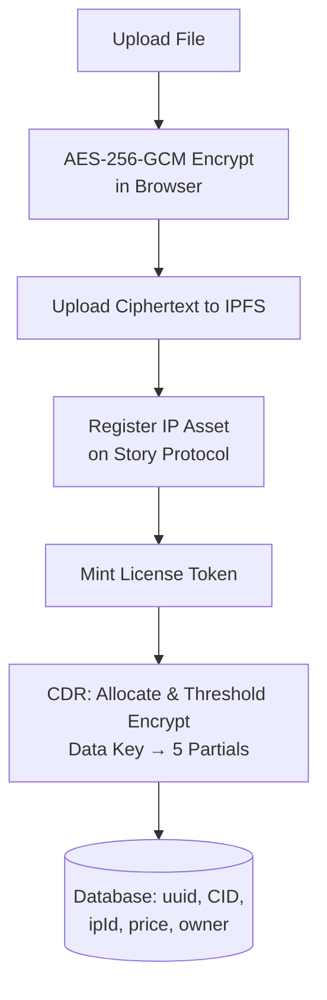
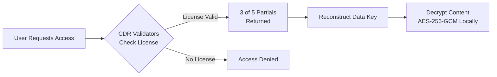
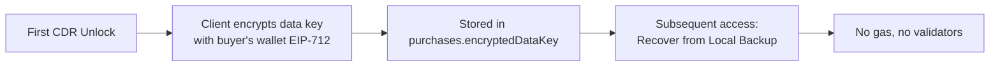
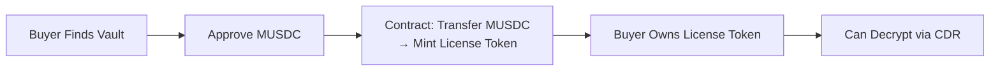
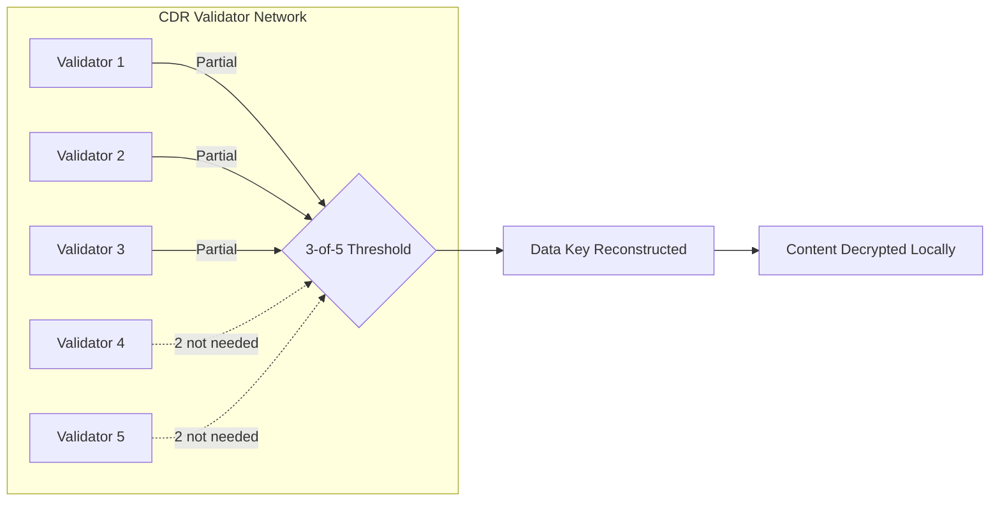

# PromptVault Litepaper

**Threshold-encrypted AI prompt vaults on Story Protocol and CDR.**

Version 1.0 — Story Protocol × CDR Hackathon 2025

---

## Table of Contents

1. [What is PromptVault?](#1-what-is-promptvault)
2. [The Problem](#2-the-problem)
3. [Vault Types](#3-vault-types)
4. [User Flows](#4-user-flows)
   - [Create a Vault](#41-create-a-vault-licensed)
   - [Threshold Decryption](#42-access-a-vault-threshold-decryption)
   - [Local Backup Access](#43-access-by-local-backup-wallet-signature)
   - [Marketplace Purchase](#44-marketplace-purchase)
5. [Architecture](#5-architecture)
6. [Security Model](#6-security-model)
7. [Technical Reference](#7-technical-reference)
8. [Value Proposition](#8-value-proposition)
9. [FAQ](#9-faq)

---

## 1. What is PromptVault?

PromptVault lets creators protect prompts, workflows, and AI assets using threshold-encrypted vaults with on-chain access control on Story Protocol.

Instead of trusting a single server with your intellectual property, the encryption key is split across independent validators. No single entity — not even us — can decrypt without authorization.

---

## 2. The Problem

AI prompts are valuable intellectual property. A well-engineered prompt can be the difference between a mediocre output and an exceptional result. Yet the current landscape has fundamental gaps:

- **No ownership registry** — anyone can copy a prompt and use it without permission
- **No monetization** — creators share prompts for free on Discord, Reddit, or public repos
- **No access control** — once shared, the creator loses all control over usage
- **Centralized servers are vulnerable** — a single point of failure compromises everything

PromptVault solves all of this by combining threshold encryption, on-chain IP registration, and programmable licensing.

---

## 3. Vault Types

| Type | Access Model | IP Registration | Marketplace |
|------|-------------|-----------------|-------------|
| **Licensed** | License Token (ERC-721) | Story Protocol | Yes |
| **Private** | Owner-only wallet | None | No |
| **Time-Locked** | Anyone after unlock timestamp | None | Yes |

### Licensed Vault

The primary vault type. Content is registered as an IP Asset on Story Protocol with programmable license terms. Buyers purchase license tokens that grant decryption rights. Enables a marketplace for prompt collections.

### Private Vault

Maximum privacy. The read condition is the creator's own EOA address. No IP registration, no license tokens, no marketplace listing. Only the creator's wallet can decrypt.

### Time-Locked Vault

A dedicated `TimeLockReadCondition` smart contract enforces `block.timestamp >= unlockTime`. Anyone can access after the unlock deadline. Ideal for scheduled releases, timed drops, or content that must become public at a specific date.

---

## 4. User Flows

### 4.1 Create a Vault (Licensed)

The main flow for vaults sold on the marketplace:



**Why AES + CDR?** The content is encrypted with AES-256-GCM (fast, standard). The AES key is then threshold-encrypted with CDR. This combines speed with distributed security.

### 4.2 Access a Vault (Threshold Decryption)

When a user owns a license token and wants to read the content:



Without a valid license, validators deny the partials. The data key is never reconstructed. The content stays encrypted.

### 4.3 Access by Local Backup (Wallet Signature)

For vaults the user created, there is a faster path that bypasses CDR:

```
1. Sign EIP-712 message with wallet
2. Signature derives AES key (wallet address + vault UUID as seed)
3. Decrypt data key locally (no validators, no gas)
4. Decrypt content with AES-256-GCM
```
**Advantage**: instant, no gas, no 30-90s validator wait.

**Limitation**: only works for the wallet that created the vault.

#### Buyer Backup

Buyers also get local backup after their first CDR unlock:



**Requirement**: one successful CDR unlock first. The backup is created as a side effect of that first access.

### 4.4 Marketplace Purchase



The marketplace uses MUSDC (a testnet stablecoin) for pricing. 1 MUSDC = 1 cent.

---

## 5. Architecture

```
User → [Privy Auth] → [Frontend Next.js 16]
                               │
                    ┌──────────┼──────────┐
                    ▼          ▼          ▼
            [Story Protocol]  [CDR]   [PostgreSQL]
            (IP Assets,       (Threshold  (Vaults DB,
             Licenses,        Encryption)  Users)
             Marketplace)
                    │
                    ▼
                [IPFS]
            (Encrypted Content)
```

### Components

| Component | Role |
|-----------|------|
| **Privy** | Social auth (Google, GitHub, email) + embedded wallets |
| **Next.js 16** | Frontend and server actions |
| **Story Protocol** | IP Asset registration, license minting, marketplace |
| **CDR SDK** | Threshold encryption (Shamir's Secret Sharing 3-of-5) |
| **PostgreSQL (Supabase)** | Vault metadata, users, prices |
| **IPFS (Pinata)** | Decentralized encrypted content storage |

---

## 6. Security Model

### Threshold Encryption (3-of-5)

The vault's master key is split into 5 fragments (partials) using Shamir's Secret Sharing. Each fragment is held by a different CDR validator. Reconstruction requires **at least 3 of 5** fragments.



**What this means in practice:**

- **No single validator can decrypt** — each holds a meaningless fragment
- **If a validator is compromised** — the other 4 still protect the key
- **If a validator goes down** — the remaining 4 can still serve partials
- **Not even PromptVault** can decrypt your vaults

### Client-Side Encryption

All encryption and decryption happens in the user's browser. The server never sees:
- The original file content
- The AES-256-GCM key
- The CDR partials
- The decrypted content

### EIP-712 for Key Backup

The backup key is derived from an EIP-712 signature. This means:
- Only the signing wallet can derive the key
- The signature is never stored anywhere
- No centralized master key to steal

---

## 7. Technical Reference

### Tech Stack

| Layer | Technology |
|-------|-----------|
| Frontend | Next.js 16, TypeScript, Tailwind CSS v4 |
| 3D | React Three Fiber, Drei, Postprocessing |
| Auth | Privy (Google, GitHub, email, wallet) |
| Blockchain | Wagmi, Viem |
| Story Protocol | Core SDK v1.4+ (IP registration, licensing) |
| CDR | @piplabs/cdr-sdk (threshold encryption, DKG) |
| Storage | IPFS via Pinata |
| Database | PostgreSQL via Supabase + Drizzle ORM |
| Network | Story Aeneid Testnet (Chain ID: 1315) |

### Smart Contracts (Aeneid Testnet)

**PromptVault Contracts**

| Contract | Address | Purpose |
|----------|---------|---------|
| TimeLockReadCondition | `0x46161d99592C2b5148a8c2593cDa268E052982F5` | Read condition for Time-Locked vaults |
| Marketplace | Configurable via env | Vault sales with MUSDC |
| MUSDC Token | Configurable via env | Stablecoin for pricing |

**Story Protocol Contracts (pre-deployed)**

| Contract | Address | Purpose |
|----------|---------|---------|
| SPG NFT Contract | `0xc32A8a0FF3beDDDa58393d022aF433e78739FAbc` | NFT bound to IP Assets |
| License Token | `0xFe3838BFb30B34170F00030B52eA4893d8aAC6bC` | License token ERC-721 |
| Licensing Module | `0x04fbd8a2e56dd85CFD5500A4A4DfA955B9f1dE6f` | Licensing operations |
| PI License Template | `0x2E896b0b2Fdb7457499B56AAaA4AE55BCB4Cd316` | PIL license template |
| WIP Token | `0x1514000000000000000000000000000000000000` | Wrapped IP |
| Owner Write Condition | `0x4C9bFC96d7092b590D497A191826C3dA2277c34B` | Write condition (owner-only) |
| License Read Condition | `0xC0640AD4CF2CaA9914C8e5C44234359a9102f7a3` | Read condition (license-gated) |

### License Terms

License tokens use **PIL (Programmable IP License)** from Story Protocol:
- **Commercial use**: true — buyers can use prompts commercially
- **Revenue share**: 0% (configurable by creator)
- **Derivatives**: false (simplified for hackathon)
- **Minting fee**: Price set by creator (in MUSDC)

---

## 8. Value Proposition

### 1. Trustless Threshold Encryption
No need to trust PromptVault or any server. Security is mathematical: 3 of 5 validators must cooperate. We cannot decrypt your data even if we wanted to.

### 2. Monetize Without Exposure
Sell access to your most valuable prompts without revealing them. Buyers pay, receive a license token, and only then can decrypt. Everything is on-chain and verifiable.

### 3. On-Chain IP
Registering a prompt as an IP Asset on Story Protocol establishes proof of ownership on-chain. License terms are programmable and self-executing.

### 4. Three Access Models
- **Licensed**: sell on the marketplace
- **Private**: personal use, maximum privacy
- **Time-Locked**: scheduled releases or public content

### 5. No Single Point of Failure
- If Pinata (IPFS) goes down — content is still in CDR (validators store partials)
- If a CDR validator goes down — the other 4 keep working
- If you lose wallet access — EIP-712 backup recovers private vaults

---

## 9. FAQ

### How is it guaranteed that even validators cannot see the content?

CDR validators only store **partials** of the key — individual fragments that are meaningless on their own. The actual content is encrypted with AES-256-GCM, and the AES key is threshold-encrypted with CDR. A validator with a single partial cannot reconstruct the AES key. 3 of 5 partials are required, and validators only deliver them if the on-chain condition is met.

### What happens if I lose access to my wallet?

For **Private** vaults you created, the EIP-712 backup lets you recover access by signing with your wallet. As long as you have access to Privy (Google/GitHub login) or your seed phrase, you can recover your vaults.

For **Licensed** vaults you purchased, you need access to the wallet that bought the license token. The ERC-721 token lives in that wallet. If you lose it, you lose access — this is intentional, the same security as any NFT.

**Important**: If you completed at least one CDR unlock as a buyer, the frontend automatically saves an encrypted local backup in `purchases.encryptedDataKey`. While you have access to that wallet (via Privy or seed phrase), you can use "Recover from Local Backup" without needing the license token.

### How does the marketplace work?

Creators list vaults with a price in MUSDC (testnet stablecoin). When a buyer pays:
1. The Marketplace contract transfers MUSDC to the creator
2. Mints a license token for the buyer
3. The buyer can decrypt via the threshold decryption flow

Private vaults do not appear in the marketplace. Time-Locked vaults appear with a countdown to their unlock time.

### What makes PromptVault different?

**vs. Google Drive / Dropbox encrypted**: They hold your keys. PromptVault does not. Threshold encryption means not even we can decrypt your data.

**vs. Public IPFS**: Your data on IPFS is encrypted. The CID is just a binary blob without the key. No one can read your content even with the CID.

**vs. Raw Story Protocol**: Story Protocol handles IP registration and licensing, but content is stored on public IPFS unencrypted. PromptVault adds the threshold encryption layer so only authorized wallets can decrypt.

**vs. Other CDR dApps**: PromptVault is the first dApp using CDR for AI content with full Story Protocol integration (IP registration + licensing + marketplace).

### What is the real cost of using CDR?

CDR on testnet (Aeneid) uses gas in IP tokens (free from the faucet). Each operation costs approximately:
- `allocate`: ~50,000 gas
- `write`: ~70,000 gas
- `access`: ~100,000 gas (includes on-chain verification + partials delivery)

On mainnet, CDR would have associated gas costs. However, there are two gas-free paths:
- **Private vaults**: Creator EIP-712 backup, instant
- **Licensed vaults (buyers)**: After the first CDR unlock, the frontend saves an encrypted local backup. Subsequent accesses are "Recover from Local Backup" — no gas, no validators.

### Can it be migrated to mainnet?

Yes. Story Protocol contracts on Aeneid are identical to mainnet (only addresses differ). The CDR SDK is designed to work on any Story network. Migration requires:
1. Deploy PromptVault contracts (TimeLock, Marketplace, MUSDC) on mainnet
2. Update addresses in `constants.ts`
3. Configure a CometBFT HTTPS proxy for CDR validators
4. Point to mainnet RPCs

The frontend code needs no changes.

### How does PromptVault prevent shared decrypted content?

It cannot be technically prevented — the same way you cannot prevent someone from screenshotting a PDF. PromptVault's value proposition is:
1. **On-chain ownership proof**: If someone shares your prompt, you have proof you created it first
2. **Traceability**: Each license token is linked to a wallet. If someone leaks purchased content, you know who
3. **Trust**: Legitimate buyers prefer paying for verified quality content over risking stolen prompts from dubious sources

### What happens if a CDR validator acts maliciously?

The CDR protocol uses **DKG (Distributed Key Generation)** where validators generate keys distributively. If a validator delivers an invalid partial:
- Other validators detect it during reconstruction
- The invalid partial is discarded and another is used
- With 3-of-5, even if 2 validators fail or act maliciously, the system keeps working

On a production mainnet deployment, there would be economic incentives (staking/slashing) to ensure correct validator behavior.

---

> Built on [Story Protocol](https://story.foundation) · Powered by [CDR SDK](https://docs.story.foundation/developers/cdr-sdk/overview)